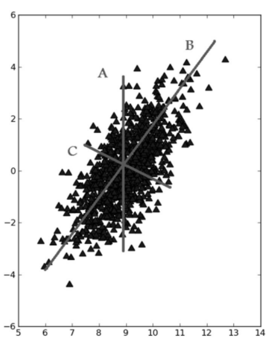
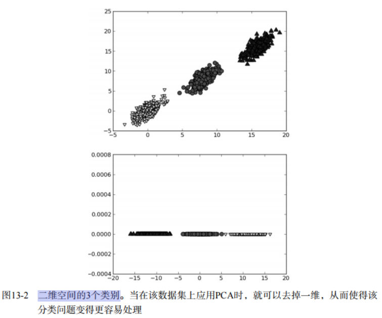

#利用PCA来简化数据

## 降维技术

###场景
* 我们正通过电视观看体育比赛，在电视的显示器上有一个球。
* 显示器大概包含了100万像素点，而球则可能是由较少的像素点组成，例如说一千个像素点。
* 人们实时的将显示器上的百万像素转换成为一个三维图像，该图像就给出运动场上球的位置。
* 在这个过程中，人们已经将百万像素点的数据，降至为三维。这个过程就称为 `降维(dimensionality reduction)`。

###据显示并非大规模特征下的唯一难题，对数据进行简化还有如下一系列的原因：
1. 使得数据集更易使用
2. 降低很多算法的计算开销
3. 去除噪声
4. 使得结果易懂

###适用范围
* 在已标注与未标注的数据上都有降维技术。
* 这里我们将主要关注未标注数据上的降维技术，该技术同时也可以应用于已标注的数据。

###降维技术
> 主成分分析(Principal Component Analysis, PCA)
* 在PCA中，数据从原来的坐标系转换到了 `新的坐标系`，新坐标系的选择是由 `数据本身决定` 的。
* 第一个新坐标轴选择的是原始数据中 `方差最大的方向`，第二个新坐标轴的选择和第一个坐标轴 `正交` 且具有 `最大方差的方向`。
* 该过程一直重复，重复次数为原始数据中 `特征的数目`。我们会发现，大部分方差都包含在最前面的几个新坐标轴中。因此，我们可以忽略余下的坐标轴，即对数据进行了 `降维处理`。
* 通俗理解：就是找出一个最主要的特征，然后进行分析。
* 例如： 考察一个人的智力情况，就直接看数学成绩就行(存在：数学、语文、英语成绩)

> 因子分析(Factor Analysis)
* 在因子分析中，我们假设在观察数据的生成中有一些观察不到的 `隐变量（latent variable）`。
* 假设观察数据是这些 `隐变量` 和 `某些噪声` 的 `线性组合`。那么 `隐变量` 的数据可能比 `观察数据` 的数目少，也就是说通过 `找到隐变量` 就可以实现 `数据的降维`。
* 通俗理解：将多个 `实测变量` 转换为少数几个 `综合指标`。它反映一种降维的思想，通过 `降维` 将相 `关性高的变量` 聚在一起,从而减少需要分析的变量的数量,而减少问题分析的复杂性
* 例如： 考察一个人的整体情况，就直接组合3样成绩(隐变量)，看平均成绩就行(存在：数学、语文、英语成绩)
* 应用: `社会科学` 、 `金融`等其他领域中。

> 独立成分分析(Independ Component Analysis, ICA)
* ICA假设数据是从 `N个数据源` 生成的，这一点和因子分析有些类似。
* 假设数据为 `多个数据源` 的 `混合观察` 结果，这些数据源之间在统计上是 `相互独立` 的，而在PCA中只假设数据是不相关的。
* 同因子分析一样，如果 `数据源` 的数目少于 `观察数据` 的数目，则可以实现降维过程。
* 通俗理解：ICA 认为观测信号是若干个 `独立信号` 的 `线性组合` ，ICA 要做的是一个 `解混` 过程。
* 例如：我们去ktv唱歌，想辨别唱的是什么歌曲？ICA 是观察发现是原唱唱的一首歌【2个独立的声音（原唱／主唱）】。

## 主成分分析（PCA）

###PCA 概述
主成分分析(Principal Component Analysis, PCA)：通俗理解：就是找出一个最主要的特征，然后进行分析。

###PCA 场景
例如： 考察一个人的智力情况，就直接看数学成绩就行(存在：数学、语文、英语成绩)

###PCA 原理

####PCA 工作原理
如下图:

1. 找出第一个主成分的方向，也就是数据 `方差最大` 的方向。
2. 找出第二个主成分的方向，也就是数据 `方差次大` 的方向，并且该方向与第一个主成分方向 `正交(orthogonal 如果是二维空间就叫垂直)`。
3. 通过这种方式计算出所有的主成分方向。
4. 通过数据集的协方差矩阵及其特征值分析，可以得到这些主成分的值。
5. 一旦得到了协方差矩阵的特征值和特征向量，就可以保留最大的 N 个特征。这些特征向量也给出了 N 个最重要特征的真实结构，我们就可以通过将数据乘上这 N 个特征向量 从而将它转换到新的空间上。

####为什么正交？
1. 正交是为了数据有效性损失最小
2. 正交的一个原因是特征值的特征向量是正交的

例如下图：

在上图中，我们只需要一维信息即可，因为另一维信息只是对分类缺乏贡献的噪声数据。

####PCA 优缺点
* 优点：降低数据的复杂性，识别最重要的多个特征。
* 缺点：不一定需要，且可能损失有用信息。
* 适用数据类型：数值型数据。

## 对半导体数据进行降维处理

###将数据转换成前N个主成分的伪代码
去除平均值\
计算协方差矩阵\
计算协方差矩阵的特征值和特征向量\
将特征值从大到小排序\
保留最上面的N个特征向量\ 
将数据转换到上述N个特征向量构建的新空间中

###PCA
* 特征值分析是线性代数中的一个领域，它能够通过数据的一般格式来揭示数据的“真实”结构，即我们常说的特征向量和特征值。
* 在等式Av = λv中，v 是特征向量， λ是特征值。
* 特征值都是简单的标量值，因此Av = λv代表的是：如果特征向量v被某个矩阵A左乘，那么它就等于某个标量λ乘以v。
* 使用NumPy中的寻找特征向量和特征值的模块linalg，它有eig()方法，该方法用于求解特征向量和特征值。

```python
def pca(dataMat, topNfeat=9999999):
    """
    PCA算法
    Args:
        dataMat: 原数据集矩阵
        topNfeat: 应用的N个特征

    Returns:
        lowDDataMat: 降维后数据集
        reconMat: 新的数据集空间

    """
    # 计算每一列的均值
    meanVals = np.mean(dataMat, axis=0)
    # print('meanVals', meanVals)
    # 每个向量同时都减去 均值
    meanRemoved = dataMat - meanVals
    # print('meanRemoved=', meanRemoved)

    # cov协方差=[(x1-x均值)*(y1-y均值)+(x2-x均值)*(y2-y均值)+...+(xn-x均值)*(yn-y均值)+]/(n-1)
    '''
    方差：（一维）度量两个随机变量关系的统计量
    协方差： （二维）度量各个维度偏离其均值的程度
    协方差矩阵：（多维）度量各个维度偏离其均值的程度
    当 cov(X, Y)>0时，表明X与Y正相关；(X越大，Y也越大；X越小Y，也越小。这种情况，我们称为“正相关”。)
    当 cov(X, Y)<0时，表明X与Y负相关；
    当 cov(X, Y)=0时，表明X与Y不相关。
    '''
    covMat = np.cov(meanRemoved, rowvar=False)
    # eigVals为特征值， eigVects为特征向量
    eigVals, eigVects = np.linalg.eig(np.mat(covMat))
    # print('eigVals=', eigVals)
    # print('eigVects=', eigVects)
    # 对特征值，进行从小到大的排序，返回从小到大的index序号
    # 特征值的逆序就可以得到topNfeat个最大的特征向量
    """
     >>> x = np.array([3, 1, 2])
    >>> np.argsort(x)
    array([1, 2, 0])  # index,1 = 1; index,2 = 2; index,0 = 3
    >>> y = np.argsort(x)
    >>> y[::-1]
    array([0, 2, 1])
    >>> y[:-3:-1]
    array([0, 2])  # 取出 -1, -2
    >>> y[:-6:-1]
    array([0, 2, 1])
    """
    eigValInd = np.argsort(eigVals)
    # print('eigValInd1=', eigValInd)

    # -1表示倒序，返回topN的特征值[-1 到 -(topNfeat+1) 但是不包括-(topNfeat+1)本身的倒叙]
    eigValInd = eigValInd[:-(topNfeat + 1):-1]
    # print('eigValInd2=', eigValInd)
    # 重组 eigVects 最大到最小
    redEigVects = eigVects[:, eigValInd]
    # print('redEigVects=', redEigVects.T)
    # 将数据转换到新空间
    # print( "---", shape(meanRemoved), shape(redEigVects))
    lowDDataMat = meanRemoved * redEigVects
    reconMat = (lowDDataMat * redEigVects.T) + meanVals
    # print('lowDDataMat=', lowDDataMat)
    # print('reconMat=', reconMat)
    return lowDDataMat, reconMat

```

